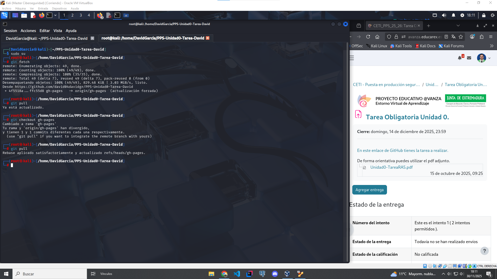

# Docker
En este documento se explica el flujo de trabajo de `Docker` para la realización de la Tarea de la Unidad 0.

Con Docker, crearemos una maquina virtual que ejecutará y desplegará la web con la documentación de MkDocs mediante un Docker con servicio Nginx.

## Flujo de trabajo

**1. Instalamos Docker en nuestro equipo**

Desde la terminal lanzamos el siguiente comando para instalar docker.

```console
sudo apt install -y docker.io
```


**2. Comprobamos que se ha instalado**

Ejecutamos el comando:

```console
docker
```
Y comprobamos que nos aparezca la documentación del comando, entonces, ya está listo para usarse.


**3. Preparamos el directorio para montar el volumen con los datos del repositorio**

Lanzamos los comandos:

```console
git fetch
```
```console
git pull
```

Así actualizamos nuestro repositorio local, y ahora nos cambiamos a la rama `gh-pages`, ya que ahí es donde se encuentran los archivos generados y ordenados por MkDocs para montar la web con la documentación, por lo tanto lanzamos el siguiente comando:

```console
git checkout gh-pages
```

Y ya tendremos en nuestro local el contenido de la rama `gh-pages` (realizamos de nuevo un git pull para actualizar la rama también).



**4. Montamos el docker y comprobamos**

Ahora debemos ejecutar el siguiente comando para ejecutar el docker, nombrarlo como "*PPSUnidad0-Tarea_DavidGarcia*", redirigir al puerto "*8085*", le montamos como volumen el directorio donde se encuentra el repositorio local en nuestra maquina anfitriona, seguido de ":" + el directorio del docker donde se va a almacenar + ":" + la propiedad "*ro*" (read-only) y por ultimo indicamos el servicio que debe ejecutar, "*Nginx*".

```console
docker run -d --name PPSUnidad0-Tarea_DavidGarcia -p 8085:80 -v $(pwd):/usr/share/nginx/html:ro nginx
```

Lanzamos y buscamos en el navegador "**localhost:8085**", y nos aparecerá la web con la documentación creada por MkDocs.


[Continuar con `Conclusión` ->](./conclusiones.md)
