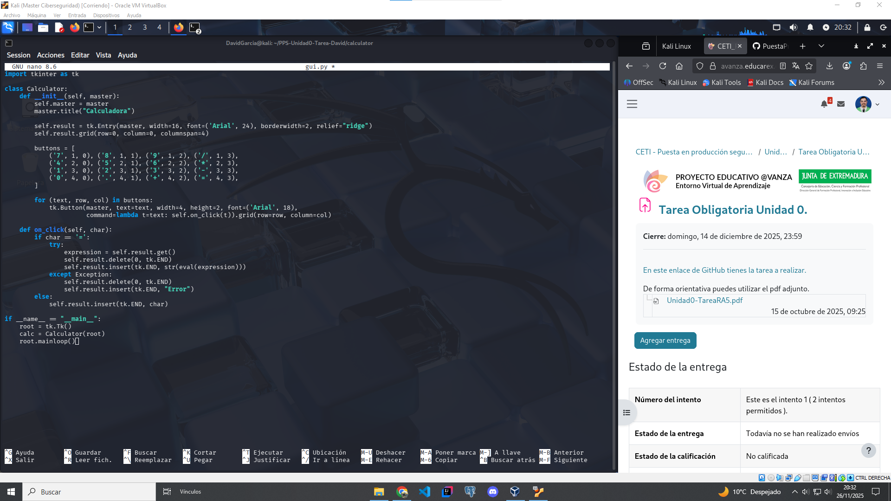
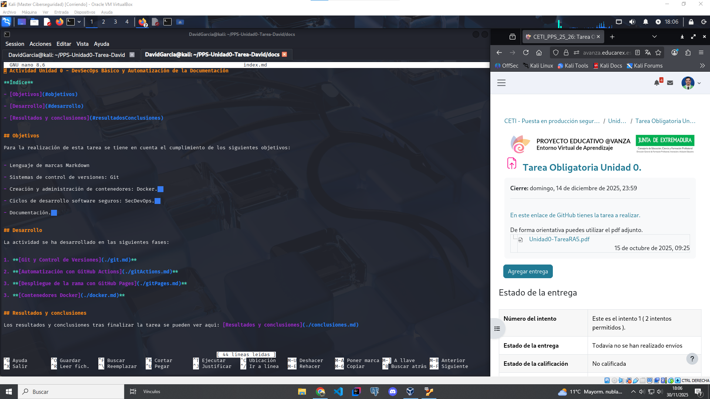
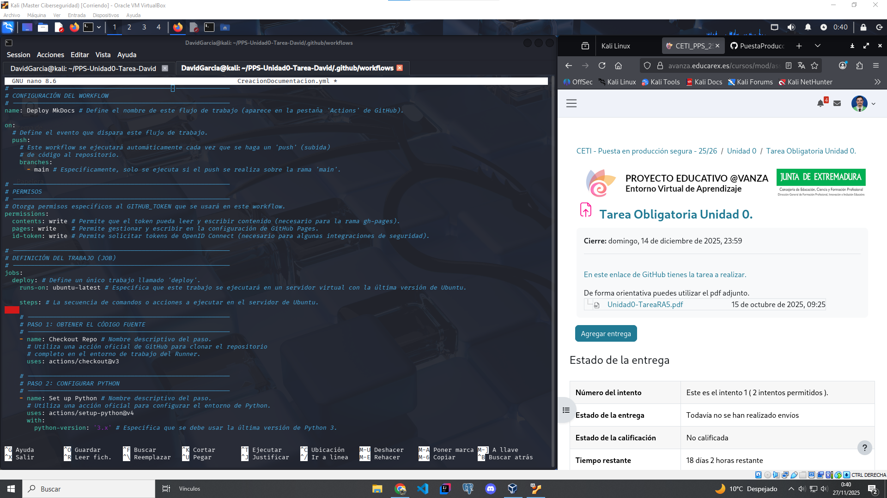

# Git y Control de Versiones

En este documento se explica el flujo de trabajo de Git para la realizacion de la Tarea de la Unidad 0.

## Requisitos y Flujo de trabajo

Se utilizó **Git** como sistema de control de versiones distribuido y **GitHub** como plataforma de repositorio remoto.

**Requisitos:**

* Tener Git instalado localmente.

* Una cuenta activa en GitHub.

**Flujo de trabajo:**

**1. Creación del repositorio *PPS-Unidad0-Tarea-David* en GitHub**

**Creamos el nuevo repositorio** desde la plataforma de `GitHub`, añadimos el nombre del repositorio, la descripción del mismo y activamos la creación del README


**2. Configuración de git y clonación del proyecto**

Accedemos a nuestra terminal, si no tenemos instalado `Git` lo instalamos con el siguiente comando:

```console

sudo apt install git

```

cuando lo hayamos instalado correctamente, configuramos nuestro usuario de git con los datos de nuestra cuenta de Github ejecutando los siguientes comandos

```console

git config --global user.name nombreUsuario

```

```console

git config --global user.email emailUsuario

```
una vez configurado el usuario, pasamos a clonar el repositorio en nuestro entorno local con el siguiente comando

```console

git clone enlaceRepositorio

```


**3. Accedemos al directorio del repositorio en local**

Una vez clonado el repositorio accedemos al mismo en el directorio local donde se ha almacenado, y podremos comprobar que se ha clonado correctamente


**4. Comenzamos a crear el arbol de directorios y archivos requeridos**


```

PPS-Unidad0-Tarea-Tu_nombre/  
├── calculator/  
│   ├── __init__.py  
│   └── gui.py  
├── docs/  
│   └── index.md    
│   └── git.md  
│   └── gitActions.md   
│   └── gitPages.md  
│   └── docker.md  
│   └── conclusiones.md 
├── mkdocs.yml   
├── requirements.txt  
└── .github/  
    └── workflows/  
        └── CreacionDocumentacion.yml  

```


y también introducimos el contenido correspondiente en cada fichero









**5. Hacemos un commit y pusheamos a la rama main**

Una vez hemos generado la estructura requerida e insertado los contenidos necesarios en cada fichero, añadimos los cambios al commit, lanzamos el commit y hacemos un push para subir este commit al repositorio.

Una vez hayamos hecho el push, veremos reflejado en la plataforma de `Github` los cambios subidos al repositorio.

**Ahora pasamos al siguiente punto, `Git Actions`**

[Continuar con `Git Actions` ->](./gitActions.md)
