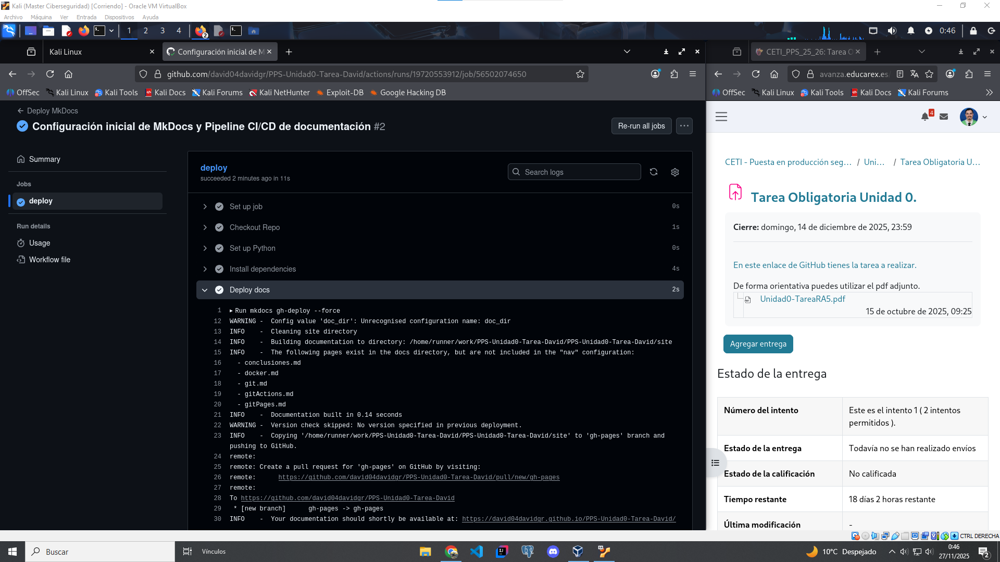

# Git Actions
En este documento se explica el flujo de trabajo de `Git Actions` para la realización de la Tarea de la Unidad 0.

## Flujo de trabajo

**1. Realizamos el commit y el push con los cambios para subirlos al repositorio**

Tal y como lo dejamos en el último punto del proceso de Git, añadimos todos los cambios al commit, lanzamos el commit y subimos estos cambios al repositorio con el push

**2. Ejecución de la pipeline automatica CI/CD con MkDocs**

Acto seguido al realizar el push hacia el repositorio se ejecutará automaticamente la pipeline programada, la cual se encargará de generar automáticamente la pagina de documentación de MkDocs con la documentación que se suba al repositorio

**3. Pasos del job de la pipeline**

Si hacemos click sobre el job accederemos al detalle del job completo, con todos los logs de todos los procesos del job, en caso de error, esto nos facilitaria el hecho de encontrar el error o fallo.

