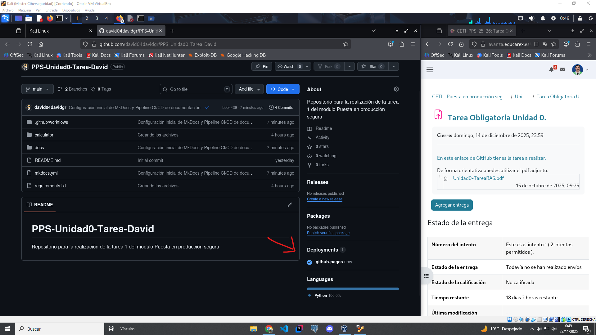

# Git Pages
En este documento se explica el flujo de trabajo de `Git Pages` para la realización de la Tarea de la Unidad 0.

Con Git Pages conseguimos que se autodespligue en una pagina web, bajo el dominio de GitHub el contenido de una rama.

## Flujo de trabajo

**1. Seleccionar la rama a desplegar**

Estando en el repositorio, accedemos a la configuración del mismo "*settings>pages*", en el apartado "*pages*" que encontramos en el menú lateral izquierdo, indicamos que queremos desplegar el contenido desde una rama y seleccionamos la rama que queremos desplegar.

**2. Volvemos al apartado "*code*" y comprobamos**

Una vez hemos configurado el despliegue, volvemos al apartado "*code*", abajo a la derecha, en la sección "*Deployments*", encontramos que ya esta desplegado en Github Pages, hacemos click y nos llevará a esta página desplegada, o en caso de tener mas de una ejecucion de la pipeline, nos llevara a una página donde encontraremos todos los despliegues realizados, como una guia de todas las versiones.

**3. Accedemos a la página**

Finalmente, accedemos a la página desplegada, mediante el enlace que nos proporciona GitHub, donde ha desplegado la web.

[Continuar con `Dockers` ->](./dockers.md)
